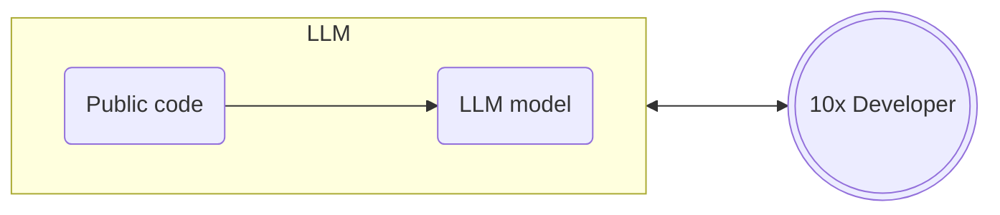
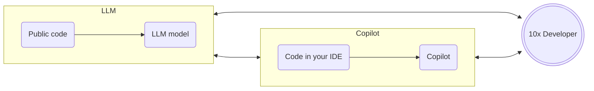
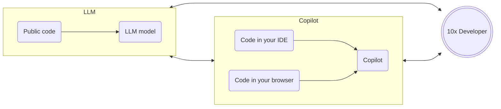
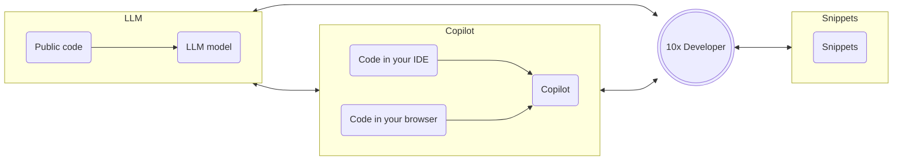
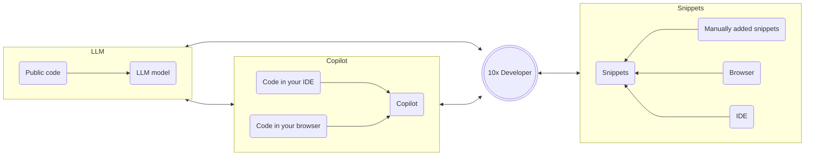
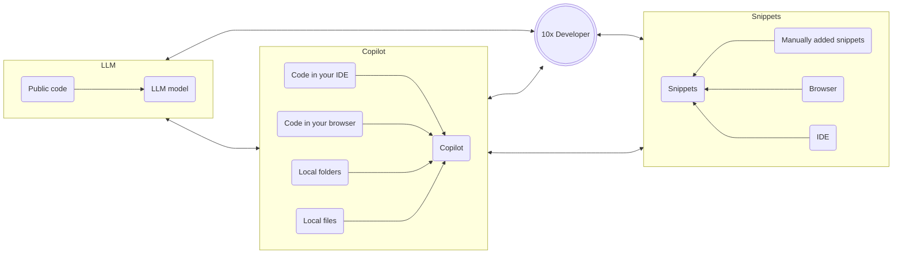
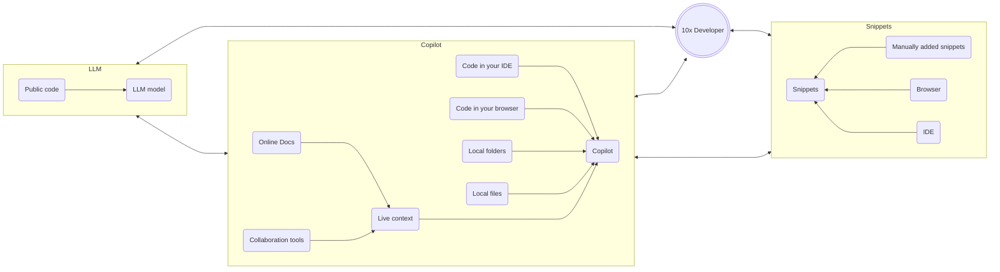

# 10x Your Developer Productivity with AI-Enabled Tools

### Presenter

Presenter title

<!--

Introduce yourself and this session.

This session will show how AI can help you become a 10x developer.

-->

---
transition: fade
layout: center
---

# A developers attention is in high demand

<!--

As developers, our attention is in high demand.

To be productive, ideally we need to be in a state of flow - focused on the task at hand with the knowledge we need at our fingertips to solve the problems we are working on.

The problem comes with having that knowledge we need at our fingertips. We end up in a sea of different tools, and are constantly context switching between them to find and understand what we need.

-->

---
transition: fade
layout: cover
---

# Pillars of development

As an engineer, you are often in one of these 3 pillars, constantly switching between them.

    

Code in your IDE

    

Collaboration tools

    

Documentation and other resources in your browser

<!--
As a developer you are often in one of these 3 pillars, constantly switching between them. 
You write code in your IDE, research and read documentation in your browser, and collaborate with your team around the code in collaboration tools like Slack or Teams.

For example, you are working on a project open in VS Code. You have a ticket to work on, and have been discussing it with colleagues in Slack. They recommend you use an open source library, so you need to read the documentation for it on GitHub.

As you are working, you are constantly switching - you write some code, flip back to the docs, ask a question on slack, then back to the code, re-read the question, go back over an earlier discussion, re-read the ticket, code, docs, and so on.

Each context switch reduces your productivity and adds opportunity for distraction. You ask a question on slack, and 'quickly' check social media whilst you await an answer. Half an hour later you finally get out of the rabbit hole of cooking videos and read the response to your question.
-->

---
transition: fade
layout: center
---

# To be more productive, you need a way to handle all this context

<!--
To be more productive, you need a better way to handle all this context.

Ideally you need a way to bring this all together so you can get relevant information using all the relevant context, and surface it where you are so you don't need to switch between tools.
-->

---
transition: fade
layout: cover
---

# Example

You are new to Flutter development, and you are adding a new page to a mobile app. You need to be aware of things like:

    

<v-clicks>

- The code base for the app
- The basics of Flutter and Dart
- Example page shared by colleagues using a custom base page
- Documentation for a UI widget you are using
- The design of the page discussed in detailed in a Jira ticket
- Discussions with coworkers about this on Microsoft Teams

</v-clicks>
    

    </img>

<!--

Let's think about a real world example.

Imagine you are new to flutter development, and have been tasked with adding a new page to a mobile app.

You need to be aware of a range of context:

- The code base for the app - you may have been given a link to the repo, or have it open in your IDE
- The basics of flutter and Dart - not only the Dart programming language, but also the Flutter framework, and potentially iOS and Android principles if you are not used to mobile development.
- Any existing code standards or requirements, such as a custom base page that your app uses, with details shared by a colleague
- Documentation for any UI widgets that you are using - for example, you may be using a custom widget from a library, and need to understand how to use it
- The design of the page. This may have been outlined and discussed in a Jira ticket, or in a design tool like Figma
- Discussions with coworkers about this on Microsoft Teams - you may have had a discussion about the page, some Dart code, or Flutter concepts.

To effectively work on this task, you need to be able to access and understand all this context quickly and easily.

-->

---
transition: fade
layout: center
---

# How do you manage all this context?

<!--

You could go old school - sticky notes, note books, note taking apps like notion, all mixed with context switching between all the tools. Lots of scrolling around and searching to find things. All of this is a productivity hit, and every context switch is an opportunity to get distracted.

-->

---
transition: fade
layout: image-right
image: "/10x-developer-productivity/img/robot-losing-papers.webp"
imageHeight: 300
imageWidth: 300
---

# This is where AI powered dev tools can help!

<!--
AI tools can help manage all this for you. AI is great at reasoning over large amounts of unstructured data. Combine an LLM that is trained on code, with an AI tool that brings in this context, and you have a powerful tool.
-->

---
transition: fade
layout: center
---

# Remember anything, interact with everything

A good tool should help you remember what you need, then bring in more context as you need it.

<!--

A good AI tool will help by remembering details from all this context, and allowing you to interact with all the details, augmented with an LLM.

-->

---
transition: fade
layout: cover
---

# AI dev tools can help you 10x your productivity

With these tools, you can:

<v-clicks>

- Use LLMs to research and write code
- Integrate Copilots into your workflow
- Manage code snippets as context for your Copilot
- Add more context from other activities to your Copilot

</v-clicks>

<!--

By using AI, you can 10x your productivity.

You start with an LLM, leveraging the knowledge they have from being trained on public code bases.

You can then augment them by using them in a copilot where they are integrated into your IDE, gathering context from your workflow.

Next you can add code snippets as context for your copilot. Over time developers build up a library of useful code snippets, and you can use these in your Copilot.

Finally, you can add more context from other activities to your Copilot. For example, you can add context from documentation, collaboration tools, and more.

And ideally, a lot of this should be as automatic as possible, requiring minimal input from you.

Over the rest of this session, we will explore these concepts in more detail, and demo how you can use these tools to 10x your productivity.

I'll be demoing using Pieces for Developers as my copilot

-->

---
transition: fade
layout: cover-logos
logos: [
    "/10x-developer-productivity/img/palm2.webp",
    "/10x-developer-productivity/img/mistral.png",
    "/10x-developer-productivity/img/Google_Gemini_logo.svg",
    "/10x-developer-productivity/img/openai-logomark.svg",
    "/10x-developer-productivity/img/Meta_lockup_positive primary_RGB.svg",
]
---

# Use LLMs to research and write code

<!--

LLMs have been trained on public code bases - you can ask them code questions.

Folks are using tools like ChatGPT and Pieces to ask code questions.

LLMs can answer all manner of questions, from researching tech stacks with questions like "what is the best way to do X in Y language" to debugging questions like "why is this code not working".

LLMs can also create code for you, either completely new code, or completing some code that you are already working on.

-->

---
transition: fade
layout: cover
---

<!--

This is the first component in your journey to being a 10x developer - leveraging an LLM to research and write code using the knowledge they have from being trained on public code bases.

-->

---
transition: fade
layout: center
---

# Demo

Create a new Flutter page with an LLM

<!--

Prompts are in the prompt file

Let's use AI to add a new page to a flutter app. We need to add an about page.

Open the code of the app in VS Code, and launch Pieces desktop.

Ask pieces desktop how to create a new page in a flutter app. It will give sample code.

Ask pieces to explain the code.

If it suggests an app bar, talk about how this is not needed, so ask for the same code without the scaffold.

Ask the copilot to change the page to have an about title and a message.

Copy this sample code and paste into the app in a new page in src/pages called about_page.dart.

Demo the new code.

-->

---
transition: fade
layout: center
disabled: true
---

<SlidevVideo v-click autoplay muted controls width="640">
  <source src="/10x-developer-productivity/video/create-about-page.mp4" type="video/mp4">
</SlidevVideo>

---
transition: fade
layout: image-right
image: "/10x-developer-productivity/img/copilot.webp"
imageHeight: 300
imageWidth: 300
---

# Integrate Copilots into your workflow

<!--

The downside of a separate app is the context switching. Context switches are an excuse to do something else - switch from IDE to LLM tool via email, chat, social media, etc.

Copilots in your IDE can help with this.
A copilot is exactly that - you are the pilot, you are in charge, and the copilot is in the cockpit with you helping you.

-->

---
transition: fade
layout: cover
---

---
transition: fade
layout: center
---

# Demo
Interact with a Copilot in your IDE

<!--

Demo using the Pieces copilot in VS Code.

Show the extension in the marketplace.
Show the copilot extension in the IDE
Show that the last Flutter conversation is there

Start a new conversation - each conversation has it's own context, so adding to an existing conversation will use the answers from before,
a new conversation will not.

Copy the about text element and ask the copilot to change the text color to red.
Delete the text and insert at cursor

Ask for the command to run a flutter app, run this in the terminal using the run in terminal command

Show code lens
Use Pieces explain to ask the copilot to explain some other code.
Use pieces comment to ask the copilot to comment the code

-->

---
transition: fade
layout: center
disabled: true
---

<SlidevVideo v-click autoplay muted controls width="640">
    <source src="/10x-developer-productivity/video/copilot-in-ide.mp4" type="video/mp4">
</SlidevVideo>

---
transition: fade
layout: cover
---

---
transition: fade
layout: center
---

# Demo

Interact with a Copilot in your web browser

<!--

Same idea - your copilot should be where you are. From your browser as you research you can use the copilot.
For example - going to the docs for a flutter widget such as icon, you can ask the copilot to explain the code in the repo.

https://api.flutter.dev/flutter/widgets/Image-class.html

Ask the copilot to explain the first 2 code snippets

Your copilot chats should also follow you. Show copilot chat from before in the browser to continue the flutter conversation with the relevant context from the web page
Use this to add an image to the about dialog using the example owl image from the flutter docs.

-->

---
transition: fade
layout: center
disabled: true
---

<SlidevVideo v-click autoplay muted controls width="640">
    <source src="/10x-developer-productivity/video/copilot-in-browser.mp4" type="video/mp4">
</SlidevVideo>

---
transition: fade
layout: image-right
image: "/10x-developer-productivity/img/js-postits.webp"
imageHeight: 300
imageWidth: 300
---

# Manage code snippets

<!---

Ask the audience- how do you normally manage code snippets?

Devs use a lot of code snippets that they need to remember. They can use tools like Notion, notes app, pen and paper etc. to manage these snippets.

Better to use an AI powered dedicated snippet management tool to not only manage snippets, but use them as context for your copilot.
By using a digital tool, you can add more data to your snippets such as tags, suggested links and more. Ideally autogenerated by an AI

-->

---
transition: fade
layout: cover
---

---
transition: fade
layout: center
---

# Demo

Curate snippets

<!--

From Pieces Desktop, show the snippets

- Add the animated_image.dart snippet and show the annotations
- Add the decorator box image snippet and show the annotations

-->

---
transition: fade
layout: center
disabled: true
---

<SlidevVideo v-click autoplay muted controls width="640">
    <source src="/10x-developer-productivity/video/add-snippet-desktop.mp4" type="video/mp4">
</SlidevVideo>

---
transition: fade
layout: cover
---

---
transition: fade
layout: center
---

# Demo

Collect snippets where you are

<!--

Snippets should be easy to grab so they become part of your workflow. This means snippet collection should be where you are, 
such as in your IDE or browser.

From the IDE grab a snippet of the copilot_service
From the browser grab a snippet from https://api.flutter.dev/flutter/widgets/Image-class.html - the same image snippet

-->

---
transition: fade
layout: center
disabled: true
---

<SlidevVideo v-click autoplay muted controls width="640">
    <source src="/10x-developer-productivity/video/add-snippet-ide-browser.mp4" type="video/mp4">
</SlidevVideo>

---
transition: fade
layout: image-right
image: "/10x-developer-productivity/img/too-much-context.webp"
imageHeight: 300
imageWidth: 300
---

# Add more context to your Copilot

<!--

To make the responses from the Copilot more relevant, you need to add more context to it.

For example, you might want the copilot to understand an entire project by adding the project folder to the context of the conversation.
You might also want to add snippets, or individual files.

-->

---
transition: fade
layout: cover
---

---
transition: fade
layout: center
---

# Demo

Use local folders in your Copilot

<!--

- Create a new conversation and add the my amazing flutter app folder as context. Then ask questions:
    - Describe this app
    - what dependencies does this app have

-->

---
transition: fade
layout: center
disabled: true
---

<SlidevVideo v-click autoplay muted controls width="640">
    <source src="/10x-developer-productivity/video/copilot-local-folder.mp4" type="video/mp4">
</SlidevVideo>

---
transition: fade
layout: center
---

# Demo

Use snippets in your Copilot

<!--

- Create a new conversation and add the animated image snippet, then ask a question
    - Explain this code
    - Comment this code
- Save the commented code as a new snippet

-->

---
transition: fade
layout: center
disabled: true
---

<SlidevVideo v-click autoplay muted controls width="640">
    <source src="/10x-developer-productivity/video/copilot-snippet.mp4" type="video/mp4">
</SlidevVideo>

---
transition: fade
layout: cover
---

---
transition: fade
layout: center
---

# Demo

Add live context

<!--

Add live context

Show the copilot chat and show it needs a spinner whilst waiting for the context to load.
Show a chat where someone recommends Spinkit (you will need to get this created up front)

Create a new conversation, turn on live context, and ask what was the flutter package that was recommended to me just now (adjust the prompt to mention the tool).

-->

---
transition: fade
layout: center
disabled: true
---

<SlidevVideo v-click autoplay muted controls width="640">
    <source src="/10x-developer-productivity/video/copilot-live-context.mp4" type="video/mp4">
</SlidevVideo>

---
transition: fade
layout: image-center
image: '/10x-developer-productivity/img/interrupt-dev.png'
imageWidth: '600'
---

# Interruptions can be costly

<!--

Interruptions can be costly - it can take 15-30 minutes to get back to the same level of focus after an interruption

-->

---
transition: fade
layout: center
---

# Demo

What was I doing just now?

<!--

Open https://stackoverflow.com/questions/71939373/how-to-use-overlay-spinner-in-flutter in the browser. Read the docs for a bit,
then follow the link to spinkit on pub.dev

Create a new conversation and ask what was I doing just now in my browser

-->

---
transition: fade
layout: center
disabled: true
---

<SlidevVideo v-click autoplay muted controls width="640">
    <source src="/10x-developer-productivity/video/live-context-browser.mp4" type="video/mp4">
</SlidevVideo>

---
transition: fade
layout: image-right
image: "/10x-developer-productivity/img/advanced-developer.webp"
imageHeight: 300
imageWidth: 300
---

# More advanced uses of AI in development

---
transition: fade
layout: cover
---

# Some more advanced uses of AI:

<v-clicks>

- Unit tests
- Error handling
- Code reviews

</v-clicks>

---
transition: fade
layout: center
---

# Demo

Unit tests

<!--

Demo adding unit tests to a code base.

Select the getPiecesOSUrl function in copilot_service.dart and ask the copilot to write a unit test for it. Show the explanation including how you need to mock Platform.

-->

---
transition: fade
layout: center
disabled: true
---

<SlidevVideo v-click autoplay muted controls width="640">
    <source src="/10x-developer-productivity/video/copilot-add-unit-test.mp4" type="video/mp4">
</SlidevVideo>

---
transition: fade
layout: center
---

# Demo

Error handling

<!--

Imagine you used the wrong icon name in the copilot page.

Open the copilot page and change the icon to AddChat:

icon: const Icon(Icons.addChat),

Try to run the app and you will get an error in the debug console.
Copy this error and ask the copilot to help you fix it.

-->

---
transition: fade
layout: center
disabled: true
---

<SlidevVideo v-click autoplay muted controls width="640">
    <source src="/10x-developer-productivity/video/copilot-error-help.mp4" type="video/mp4">
</SlidevVideo>

---
transition: fade
layout: center
---

# Demo

Code reviews

<!--

Demo reviewing code. Open the copilot_chat.dart file, select all the code, and ask the copilot to review it.

-->

---
transition: fade
layout: center
disabled: true
---

<SlidevVideo v-click autoplay muted controls width="640">
    <source src="/10x-developer-productivity/video/copilot-review-code.mp4" type="video/mp4">
</SlidevVideo>

---
transition: fade
layout: image-right
image: "/10x-developer-productivity/img/conclusion.webp"
imageHeight: 300
imageWidth: 300
---

# Conclusion

AI can help you 10x your productivity

<!--
AI is your support mechanism. It won't replace you, but can make you more productive.
-->

---
transition: fade
layout: cover
---

# Leverage AI to:

<v-clicks>

- Research and write code
- Stay focused using a Copilot
- Bring together context from different sources
- Handle basic coding tasks

</v-clicks>

---
transition: fade
layout: cover
---

# Want to learn more?

<QRCode
    :width="300"
    :height="300"
    type="svg"
    data="https://pieces.app/?utm_source=workshops&utm_medium=presentation&utm_campaign=workshops-qr"
    :margin="10"
    :imageOptions="{ margin: 10 }"
    :dotsOptions="{  color: 'white' }"
    image="/img/white-pieces-circle.png"
/>

### Pieces.app

