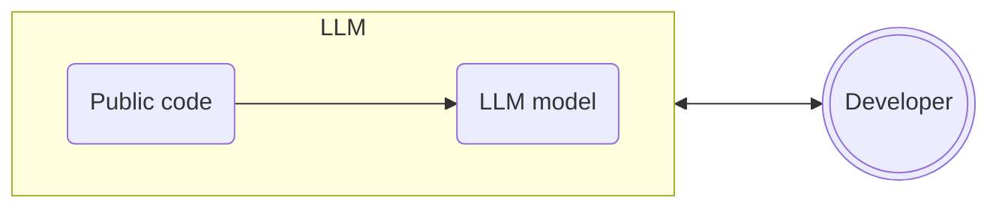
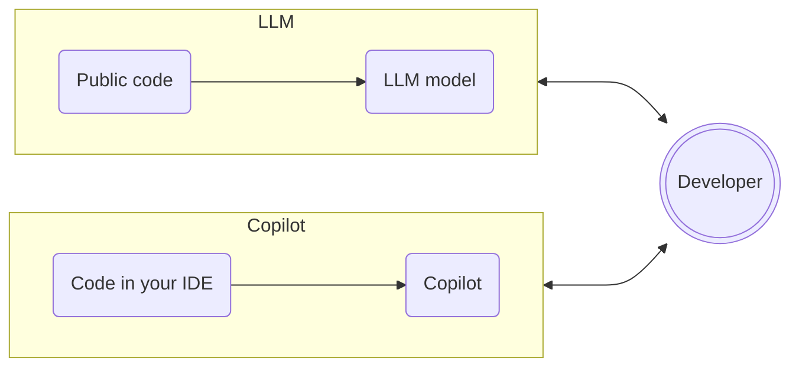
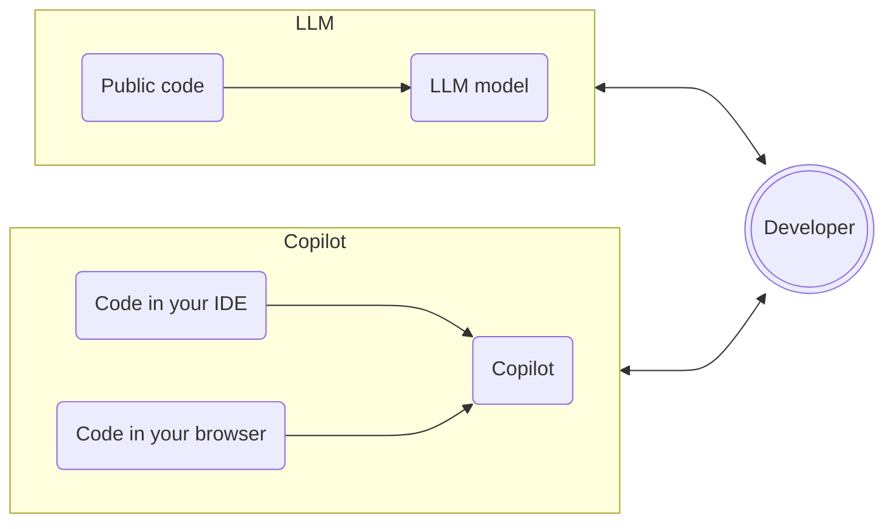
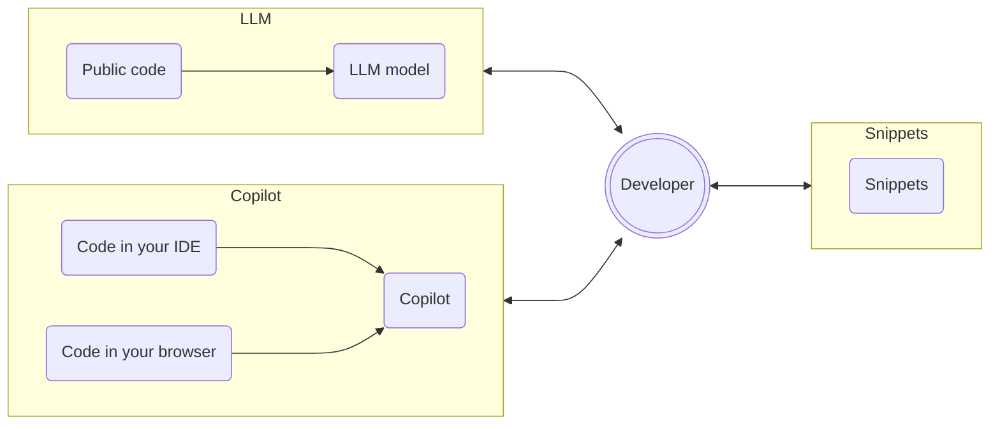
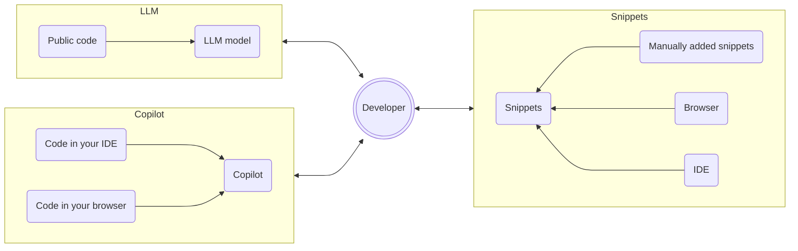
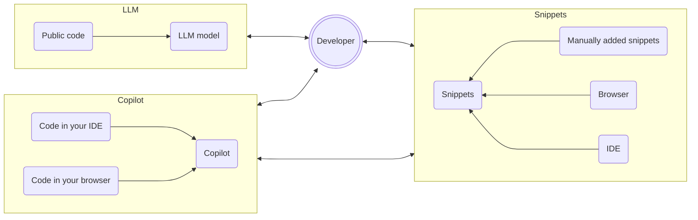
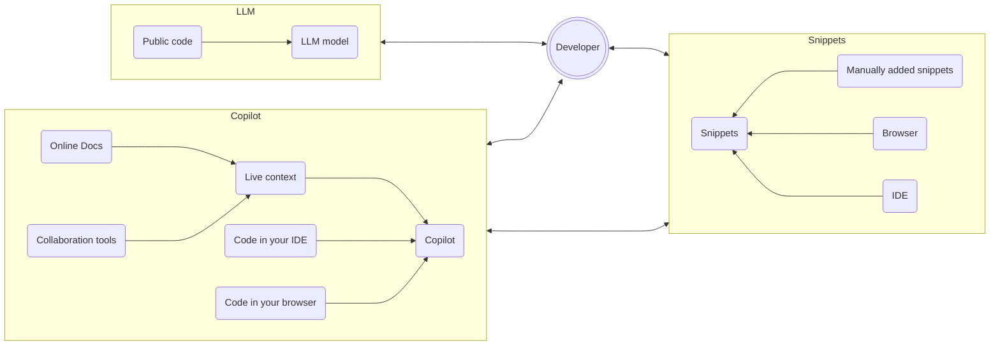

# 10x Your Developer Productivity with AI-Enabled Tools

### Presenter

Presenter title

---
transition: fade
layout: center
---

# A developers attention is in high demand

<!--

A developers attention is in high demand - large amounts of context switching, and a sea of tools and ever growing amounts of data

-->

---
transition: fade
layout: cover
---

# Pillars of development

As an engineer, you are often in one of these 3 pillars, constantly switching between them.

    

Code in your IDE

    

Documentation and other resources in your browser

    

Collaboration tools

<!--
As a developer you are often in one of these 3 pillars, constantly switching between them. 
You write code in your IDE, research and read documentation in your browser, and collaborate with your team around the code in collaboration tools.
-->

---
transition: fade
layout: center
---

# To be more productive, you need a way to handle all this context

---
transition: fade
layout: cover
---

# Example

You are new to Flutter development, and you are adding a new page to a mobile app. You need to be aware of things like:

    

<v-clicks>

- The basics of Flutter and Dart
- Example page shared by colleagues using a custom base page
- Documentation for a UI widget you are using
- The design of the page discussed in detailed in a Jira ticket
- Discussions with coworkers about this on Microsoft Teams

</v-clicks>
    

    </img>

---
transition: fade
layout: center
---

# How do you manage all this context?

<!--

You could go old school - sticky notes, note books, context switching

-->

---
transition: fade
layout: image-right
image: "/10x-developer-productivity/img/robot-losing-papers.webp"
imageHeight: 300
imageWidth: 300
---

# This is where AI powered dev tools can help!

<!--

AI tools can help manage all this for you.

-->

---
transition: fade
layout: center
---

# Remember anything, interact with everything

A good tool should help you remember what you need, then bring in more context as you need it.

<!--

This demo shows the ideal way for AI to assist you - remember anything, interact with everything.
-->

---
transition: fade
layout: cover
---

# AI dev tools can help you 10x your productivity

With these tools, you can:

<v-clicks>

- Use LLMs to research and write code
- Integrate Copilots into your workflow
- Manage code snippets
- Add more context to your Copilot

</v-clicks>

<!--

Will demo using Pieces as my copilot

-->

---
transition: fade
layout: cover-logos
logos: [
    "/10x-developer-productivity/img/palm2.webp",
    "/10x-developer-productivity/img/mistral.png",
    "/10x-developer-productivity/img/Google_Gemini_logo.svg",
    "/10x-developer-productivity/img/openai-logomark.svg",
    "/10x-developer-productivity/img/Meta_lockup_positive primary_RGB.svg",
]
---

# Use LLMs to research and write code

<!--

LLMs have been trained on code - you can ask them code questions.
Folks are using tools like ChatGPT, or Pieces to ask code questions - create code, understand code etc.

-->

---
transition: fade
layout: cover
---

---
transition: fade
layout: center
---

# Demo

Create a new Flutter page with an LLM

<!--

Need to pre-record a video of this to avoid any issues with the demo

Demo - use Pieces Desktop to create a new Flutter page. Launch Pieces Desktop, and ask it to create a new page in a flutter app.
Use a pre-canned flutter app (needs to be written) and ask Pieces to create a new page in it.

Dig more into the demo - ask more questions such as what does this code do, how do I use this widget, etc.

Add some code, and ask for an explanation of the code.
Add some code via a screenshot and ask for an explanation

Add this code to the app and demo it.

-->

---
transition: fade
layout: image-right
image: "/10x-developer-productivity/img/copilot.webp"
imageHeight: 300
imageWidth: 300
---

# Integrate Copilots into your workflow

<!--

The downside of a separate app is the context switching. Context switches are an excuse to do something else - switch from IDE to LLM tool via email, chat, social media, etc.

Copilots in your IDE can help with this.
A copilot is exactly that - you are the pilot, you are in charge, and the copilot is in the cockpit with you helping you.

-->

---
transition: fade
layout: cover
---

---
transition: fade
layout: center
---

# Demo
Interact with a Copilot in your IDE

<!--

Demo using the Pieces copilot in VS Code.
Start with using the copilot chat to ask questions about code
Use integrations with the IDE:
- Ask for the command to run a flutter app, run this in the terminal
- Right click - Ask copilot
- Pieces explain, Pieces comment from code lens

-->

---
transition: fade
layout: cover
---

---
transition: fade
layout: center
---

# Demo

Interact with a Copilot in your web browser

<!--

Same idea - your copilot should be where you are. From your browser as you research you can use the copilot.
For example - going to the GitHub repo for a flutter widget, you can ask the copilot to explain the code in the repo.
Your copilot chats should also follow you. Show copilot chat from before in the browser to continue the flutter conversation with the relevant context from the web page

-->

---
transition: fade
layout: image-right
image: "/10x-developer-productivity/img/js-postits.webp"
imageHeight: 300
imageWidth: 300
---

# Manage code snippets

<!---

Ask the audience- how do you normally manage code snippets?

Devs use a lot of code snippets that they need to remember. They can use tools like Notion, Evernote, etc. to manage these snippets.

Better to use an AI powered dedicated snippet management tool to not only manage snippets, but use them as context for your copilot.
By using a digital tool, you can add more data to your snippets such as tags, suggested links and more. Ideally autogenerated by an AI

-->

---
transition: fade
layout: cover
---

---
transition: fade
layout: center
---

# Demo

Curate snippets

<!--

Curate snippets through Pieces Desktop - add a flutter page snippet
Add snippet using a screenshot from a whiteboard - need good handwriting!
Show searching for a snippet, and asking the copilot

-->

---
transition: fade
layout: cover
---

---
transition: fade
layout: center
---

# Demo

Collect snippets where you are

<!--

Curate snippets through IDE, browser extensions
Grab a snippet from the Flutter page, and the GitHb page for a widget

-->

---
transition: fade
layout: image-right
image: "/10x-developer-productivity/img/too-much-context.webp"
imageHeight: 300
imageWidth: 300
---

# Add more context to your Copilot

<!--

To make the responses from the Copilot more relevant, you need to add more context to it.

-->

---
transition: fade
layout: cover
---

---
transition: fade
layout: center
---

# Demo

Use snippets in your Copilot

<!--

Show using snippets to ask the copilot and add to context to get answers

-->

---
transition: fade
layout: cover
---

---
transition: fade
layout: center
---

# Demo

Add live context

<!--

Add live context from a canned chat about Flutter

-->

---
transition: fade
layout: image-center
image: '/10x-developer-productivity/img/interrupt-dev.png'
imageWidth: '600'
---

# Interruptions can be costly

<!--

Interruptions can be costly - it can take 15-30 minutes to get back to the same level of focus after an interruption

-->

---
transition: fade
layout: center
---

# Demo

What was I doing just now?

<!--

Show live context by asking what was I doing

-->

---
transition: fade
layout: image-right
image: "/10x-developer-productivity/img/advanced-developer.webp"
imageHeight: 300
imageWidth: 300
---

# More advanced uses of AI in development

---
transition: fade
layout: cover
---

# Some more advanced uses of AI:

<v-clicks>

- Unit tests
- Error handling
- Automating repetitive tasks
- Code reviews

</v-clicks>

---
transition: fade
layout: center
---

# Demo

Unit tests

<!--

Demo adding unit tests to a code base

-->

---
transition: fade
layout: center
---

# Demo

Error handling

<!--

Demo researching and handling errors

-->

---
transition: fade
layout: center
---

# Demo

Automating repetitive tasks

<!--

Demo automating something like JSON generation

-->

---
transition: fade
layout: center
---

# Demo

Code reviews

<!--

Demo reviewing code

-->

---
transition: fade
layout: image-right
image: "/10x-developer-productivity/img/conclusion.webp"
imageHeight: 300
imageWidth: 300
---

# Conclusion

