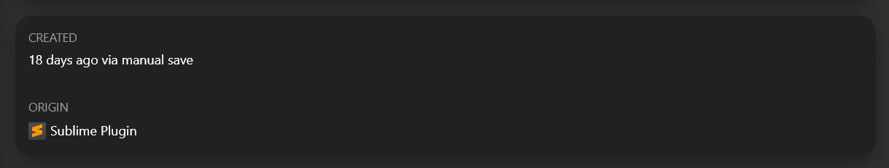

# Build with Pieces

Welcome to this workshop on learning how to use the pieces_os_client [Python SDK](https://github.com/pieces-app/pieces-os-client-sdk-for-python/).

## Introduction

The pieces_os_client Python SDK is a powerful tool for integrating Pieces OS functionality into your Python applications. This workshop will help you understand and utilize its key features.

## Installation

To get started, install the SDK using pip:

```bash
pip install pieces-os-client
```

## Core Elements

The `pieces_os_client` SDK is composed of essential elements:

- API Client: Essential for all requests, storing crucial data such as the host.
- Models: Define the structure of the response body sent to the Pieces OS API.
- APIs: Modules offering diverse functionalities (e.g., AssetsAPI, QGPTApi).

Every API requires a specific model to facilitate sending requests to the API. All necessary APIs and models for sending responses can be found. Additionally, each model corresponds to a specific API. For more information on the APIs and models, refer to the documentation at docs.pieces.app/build.

## API Client

The API Client object store some data that is used in every request here is how you can define it

```python
import pieces_os_client
import platform

# Defining the port based on the operating system. For Linux, the port is 5323, and for macOS/Windows, the port is 1000.
platform_info = platform.platform()
if 'Linux' in platform_info:
    port = 5323
else:
    port = 1000

# The `basePath` defaults to http://localhost:1000, however we need to change it to the correct port based on the operating system.
configuration = pieces_os_client.Configuration(host=f"http://localhost:{port}")

# Initialize the Pieces ApiClient
api_client = pieces_os_client.ApiClient(configuration)
```

## Connector API

The Connector API is a key part of defining your application's interaction with Pieces OS. It includes:

```python
# Decide if it's Windows, Mac, Linux or Web
local_os = platform.system().upper() if platform.system().upper() in ["WINDOWS","LINUX","DARWIN"] else "WEB"
local_os = "MACOS" if local_os == "DARWIN" else local_os

api_instance = pieces_os_client.ConnectorApi(api_client)
seeded_connector_connection = pieces_os_client.SeededConnectorConnection(
	application=pieces_os_client.SeededTrackedApplication(
		name = ApplicationNameEnum.OPEN_SOURCE, # You should change the application here 
		platform = local_os, # Platform: MACOS,WINDOWS,LINUX,WEB,UKNOWN
		version = "1.0.0")) # The application version
api_response = api_instance.connect(seeded_connector_connection=seeded_connector_connection)
application = api_response.application
application_id = application.id
```
The application model plays a crucial role in constructing the majority of API responses; it is indispensable for numerous API requests.

No wonders here the desktop app knows the orgin of the snippet



Now after we learned about the fundamentals about Pieces OS, we are ready to explore the APIs endpoints

## Wellknown API

The wellknown API contains two endpoints for getting Pieces OS health and version

```python
from pieces_os_client import WellKnownApi

version = WellKnownApi(api_client).get_well_known_version() # Get the current Pieces OS version
# output: 10.0.2 

health = WellKnownApi(api_client).get_well_known_health() # Get the Pieces OS health
# output: ok
```

## Models API

The models API has very important endpoint which is the model snapshot, This will get a snapshot of all of your AI models. 
This endpoint will return [models](https://docs.pieces.app/build/reference/python/models/Models) model 

```python 
from pieces_os_client import ModelsApi
models = ModelsApi(api_client).models_snapshot()
```
This is crucial in the QGPT API. You will need the model ID (which model to ask?).
```python
for model in models.iterable:
	print(model.name,model.id)
```
This snippet above going to print every model on avaiable with Pieces OS

You can also filter out the installed models or the cloud models only 
```python
for model in models.iterable:
	if model.cloud or model.downloaded:
		print(model.name,model.id)
```
You can also [read more](https://docs.pieces.app/build/reference/python/apis/ModelApi#) about the model API for downloading local LLM models.

## QGPT API

The [QGPT API](https://docs.pieces.app/build/reference/python/apis/QGPTApi) has some endpoints which are very useful for asking our favorite model the question that we want.

### QGPT Stream endpoint

The QGPT Stream endpoint is useful for the chatting and creating a conversation with the Copilot.

Sadly the SDKs does not provide a way to connect to the websocket so we need to handle the websockets manually

```python
from pieces_os_client import QGPTStreamOutput,QGPTStreamInput
from websocket import WebSocketConnectionClosedException


class AskStreamWS:
	@property
	def url(self):
		return "ws://localhost:1000/qgpt/stream"

	def on_message(self,ws, message):
		QGPTStreamOutput.from_json(message)
		if message.question:
			answers = message.question.answers.iterable

			for answer in answers:
				print(answer)
		
		if message.status == "COMPLETED":
			self.conversation_id = message.conversation # Here is the conversation id we can store it for later use
			# Do what every logic You want here
		elif message.status == "FAILED":
			# Probably gonna fail because the internet connect.
			pass


	
	def send_message(self,message:QGPTStreamInput):
		try:
			if not self.ws:
				raise WebSocketConnectionClosedException()
			self.ws.send(message.to_json())
		except WebSocketConnectionClosedException:
			self.on_open = lambda ws: ws.send(message.to_json()) # Send the message on opening
			self.start() # Start a new websocket since we are not connected to any

	def on_error(self, ws, error):
		print(f"Error: {error}")

	def on_close(self, ws, close_status_code, close_msg):
		pass

	def on_open(self, ws):
		self.running = True

	def run(self):
		self.ws = websocket.WebSocketApp(
			self.url,
			on_message=self.on_message,
			on_error=self.on_error,
			on_close=self.on_close,
			on_open=self.on_open
		)
		self.ws.run_forever()
```
Here is the websocket class, We can now send a question to the QGPT API stream
```python
from pieces_os_client import QGPTStreamInput,QGPTQuestionInput
ws = AskStreamWS()
ws.send_message(
	QGPTStreamInput(
		question=QGPTQuestionInput(
			query="Hi how are you",
			application=application.id,
			model = model.id
		),
		conversation = conversation_id,
	))
```

Here is an example on how to send a question to the QGPT endpoint. You will need to change the query.

Also note for the conversation_id you can get an actual conversation_id from the conversations endpoint or you can leave it None if None it will create a new conversation.

You should already know what is the [model.id](#models_api) and [application.id](#connector_api)

