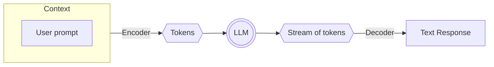
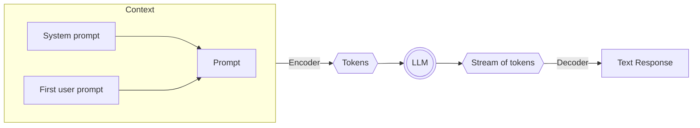
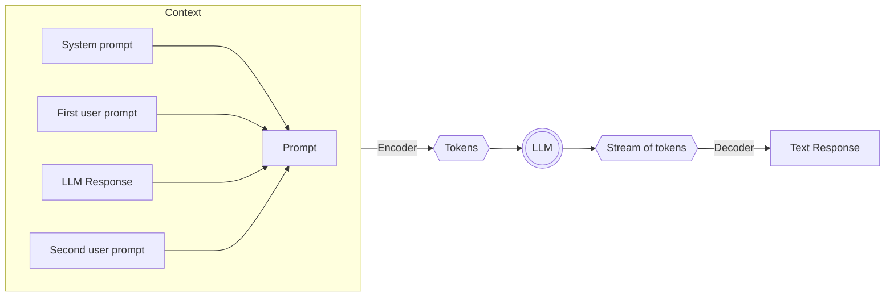

# Use an LLM anywhere with offline AI

### Presenter

Presenter title

---
transition: fade
layout : center
---

# Who has ever suffered from no internet?

<!--

I want to ask a personal question - who has ever suffered from no internet?

Trying to search for something, or do something, and you can't because you have no internet.

-->

---
transition: fade
layout : default
---

# Who uses ChatGPT or other LLM tools?

<v-click>
How do you use these when offline?
</v-click>

---
transition: fade
layout: default
---

# Demo

Use an LLM... offline!

<!--

Turn wifi off. 
Demo asking the Pieces copilot what is an LLM, and how to use an LLM offline

-->

---
transition: fade
layout: center
disabled: true
---

<SlidevVideo v-click autoplay muted controls width="640">
    <source src="/10x-developer-productivity/video/copilot-in-ide.mp4" type="video/mp4">
</SlidevVideo>

<!--

TODO - update video

-->

---
transition: fade
layout: cover-logos
logos: [
    "/img/llms/palm2.webp",
    "/img/llms/mistral.png",
    "/img/llms/Google_Gemini_logo.svg",
    "/img/llms/openai-logomark.svg",
    "/img/llms/Meta_lockup_positive primary_RGB.svg",
]
---

# So what is an LLM?

---
layout: default
transition: fade
---

# An LLM is a large language model

<v-clicks>

- A model that can understand and generate human language
- Trained on a massive dataset of text - think the entire internet, terabytes of data
- Examples: GPT-4o, Palm, Mistral, Gemini, Phi-2

</v-clicks>

<!--

LLMs are AI models that excel at natural language processing. You interact with them using a prompt in natural language, and they generate a response in natural language.

They are trained on a massive dataset of text, which is why they are so good at understanding and generating human language. This includes pretty much the entire internet, so terabytes of data.

Examples of LLMs include GPT-4o, Palm, Mistral, Gemini, and Phi-2.

-->

---
layout: default
transition: fade
---

# LLMs do not:

<v-clicks>

- Have any understanding of the world
- Have any knowledge beyond what they were trained on (unless you use RAG or similar)
- Guarantee to be correct
- Have a consciousness, common sense, or emotions

</v-clicks>

<!--

LLMs are sort of a really fancy autocomplete. They don't understand the world, they just predict the next word in a sentence based on the words that came before it.

They also don't have knowledge beyond what they were trained on. For example, you can't ask an LLM todays date, or about things that happened yesterday. There are techniques to do this however, called RAG - retriever augmented generation. This allows the LLM to look up relevant information to help boost its response.

LLMs also don't guarantee to be correct. They are very good at generating text, but they can also generate nonsense, or incorrect information. This is known as hallucination. For example, when ChatGPT first came out a lawyer used it to find a legal precedent, and it generated a fake one. 

Finally, LLMs don't have a consciousness, common sense, or emotions. They are just a model that generates text based on the text they were trained on. The terminator is not coming for us just yet. Yet.

-->

---
layout: default
transition: fade
---

# How do you interact with an LLM?

<!--

LLMs work with tokens instead of raw text. Tokens can be letters, or even whole words. Each LLM has a different tokenization scheme. Tokens are important models have token limits, and charge per token.

For example, GPT-4o has an input token limit of 128k tokens - this is known as the context window. If you exceed this limit, the model will truncate the input or error.

Models also have a token limit for the response. For example, GPT-4o has a response token limit of 4k tokens.

The cost of using an LLM is based on the number of tokens you use. For example, at the time of writing, GPT-4o is $5 per 1m input tokens, and $15 per 1m output tokens.

-->

---
transition: fade
layout: default
---

# Demo

Interact with an LLM

<!--

Demo asking an LLM a long question. Note how the response streams back in real-time.

-->

---
transition: fade
layout: center
disabled: true
---

<SlidevVideo v-click autoplay muted controls width="640">
    <source src="/10x-developer-productivity/video/copilot-in-ide.mp4" type="video/mp4">
</SlidevVideo>

<!--

TODO - update video

-->

---
layout: default
transition: fade
---

# How do you interact with a chat-based LLM?

---
layout: default
transition: fade
---

<!--

Each call to an LLM is independent. You can't have a conversation with an LLM like you would with a human.

The way tools like ChatGPT work is by tracking the conversation in the prompt. Essentially the prompt is the conversation history. Usually the prompt has additional information provided by the chat tool.

The information that sets up the chat tool is called a system prompt. The system prompt is the same for every call to the LLM. The prompt that is sent to the LLM is the system prompt, then the user prompt.

-->

---
layout: default
transition: fade
---

<!--

As you ask more questions, the answer is added to the prompt. This is how the LLM can generate responses that are relevant to the conversation. System prompt, then user prompt for the first question, then system prompt, user prompt, response, next user prompt for the second question, and so on.

-->

---
layout: center
transition: fade
---

# How do LLMs run?

GPUs. Lots of GPUs.

<!--

LLMs typically run in the cloud using a lot of GPUs. How many? 

This is not public knowledge, but some guesses recon to run a single GPT-3 query takes at least 8 top of the range A100 GPUs with 80GB of RAM each.
GPT-3 - we've gone much further since then.

-->

---
transition: fade
layout: image-center
image: '/use-llm-anywhere/img/amazon-gpu.png'
imageWidth: '800'
---

<!--

Not cheap! One of these is $17k on amazon.

As LLMs get better, they need more power - especially more GPUs and RAM.

-->

---
layout: center
transition: fade
---

# How big is an LLM?

LLM size is measured in parameters - the weights in a neural network.

<!--

The size of an LLM is measured in parameters. Parameters are the weights in a neural network. The more parameters, the more powerful the model.
Think of this as like the different possible combinations in a card matching game. The more cards, the more matches you can make.

For example if you put out pairs of just picture cards, you can only make 4 matches. If you put out pairs of all the cards in a deck, you can make 13 matches. The more parameters, the more data you can pull out as the model holds more data encoded by the weights.

-->

---
layout: cover
transition: fade
---

# LLM parameter sizes

- GPT-4: ~1.8 trillion
- Gemini: ~1.5 trillion

<v-click>

- Human brain: ~700 trillion

</v-click>

<!--

The number of parameters of the top models is not published, but the guesses for the latest are in the trillions. These are big!

The guess for the human brain is around 700 trillion synapses. This doesn't map directly to parameters, but it gives you an idea of the scale of these models.

-->

---
layout: cover
transition: fade
---

# LLM memory usage

Depends on the quantization and model size

<v-click>

Assuming 1.8 trillion parameters, 32-bit float:

1.8 trillion * 32 bits = 6.5 terabytes

</v-click>

<!--

Each parameter is a number. This can be a 32-bit float, 16-bit float, or even an 8-bit or 4-bit integer. 

The larger the number, the better the model - it has more data encoded in it. But the larger the number, the more memory it uses.

The smaller the number, the less memory the model uses.

-->

---
layout: cover
transition: fade
---

# I don't have a data center in my pocket

So how can I run these offline?

<!--

These models are stupidly large, and need a full data center with GPUs, RAM, and a lot of power to run.

I don't have one of these in my pocket - if I did I'd need very large pockets and a portable power station.

So how can I run these offline?

-->

---
layout: cover
transition: fade
---

# Introducing SLMs - small language models

<!--

The solution is small language models. Same principle as LLMs, but less parameters and smaller quantization.

Not as good as LLMs, but good enough! Small enough to run on device.

-->

---
layout: cover
transition: fade
---

| Model        | Parameters | Size   | 
| ------------ | ---------- | ------ |
| Llama 3      | 8B         | 4.7 GB |
| Llama 3      | 70B        | 40 GB  |
| Mistral      | 7B         | 4.1 GB |
| Phi-3 Mini   | 3.8B       | 2.3 GB |
| Phi-3 Medium | 14B        | 7.9 GB |

<!--

These have a lot less parameters than the large models - 8B compared to 1.8T.

These sizes are the model size. To run these you need more memory than model size, about double.

Show memory available on your device and compare to these sizes. My laptop has 24GB of RAM, so I can run all except the 70B Llama 3.

These are small enough to run on your CPU, or even your local GPU depending on what you have. GPUs are faster.

-->

---
layout: image-center
image: '/img/white-pieces-for-developers.svg'
imageWidth: '400'
transition: fade
---

# Demo

Use different LLMs... offline!
 
 

<!--

I'm going to use Pieces for this first demo - it supports a range of LLMs locally and in the cloud.

Make sure WiFi is off.

Pick each LLM and ask it a question. Ask the audience for ideas as to what to ask. Cover both technical (generating code) and non-technical questions.

Compare speed depending on model size. Show memory usage of Pieces OS during the process

-->

---
layout: default
transition: fade
---

# Demo

SLM vs LLM

<!--

Compare SMLs and LLMs.

Ask the audience for a question, and ask the SLM. Time it and look at the amount of detail and memory usage.

Select a cloud LLM and ask the same question in a new conversation. Time it and again compare the detail.

Repeat for a few questions.

-->

---
layout: default
transition: fade
---

# Why use an SLM?

SLMs are not as good as an LLM, so why would you use one?

<v-clicks>

- Lack of internet
- Cost
- Privacy

</v-clicks>

<!--

As we've seen, SLMs are good, but not as good as an SLM. So why would we use one?

THe first reason is lack of internet access. Not a huge problem in the developed world unless you are on a tube, in the middle of the countryside, or on a plane.
However, in the developing world, internet access is not as common. SLMs can be used in these areas.

One example - students in developing nations, such as across Africa. Internet can be expensive or unavailable outside of the college campus. Imagine being able to use the campus internet to download a model, then use it offline at home.

Offline models also have no cost to run beyond the power to your device. Although LLM costs are low and dropping as the market gets more competitive, there is still a cost for a reasonable amount of usage. By running models offline there is no cost.

Finally privacy. When you use an LLM in the cloud, you are sending data such as our prompt to the cloud. Not a privacy risk if you are asking basic tech questions, but it's easy to send your companies IP, or personal or private information. For example, Samsung employees leaked trade secrets by asking ChatGPT questions using their private IP, and this was used to retrain the model and subsequently available to the right prompt.
You can also use offline models with sensitive or private data. For example, teachers asking for summarizations of report cards or requirements for students with special needs. This is protected by law in many countries, and sending this data to the cloud could be a breach of the law as well as student/parent/teacher trust. Same with medical data. criminal records or secret government data.

By using an SLM you can keep your data on your device.

-->

---
transition: fade
layout: default
---

# Conclusion

LLMs are great, but not always practical. Use SLMs when you need to run offline.

<!--

LLMs are great, but not always practical. If you need to run offline due to lack of internet, cost, or privacy, use an SLM.

-->

---
transition: fade
layout: cover
---

# Want to learn more?

<QRCode
    :width="300"
    :height="300"
    type="svg"
    data="https://pieces.app/?utm_source=workshops&utm_medium=presentation&utm_campaign=workshops-qr"
    :margin="10"
    :imageOptions="{ margin: 10 }"
    :dotsOptions="{  color: 'white' }"
    image="/img/white-pieces-circle.png"
/>

### Pieces.app

